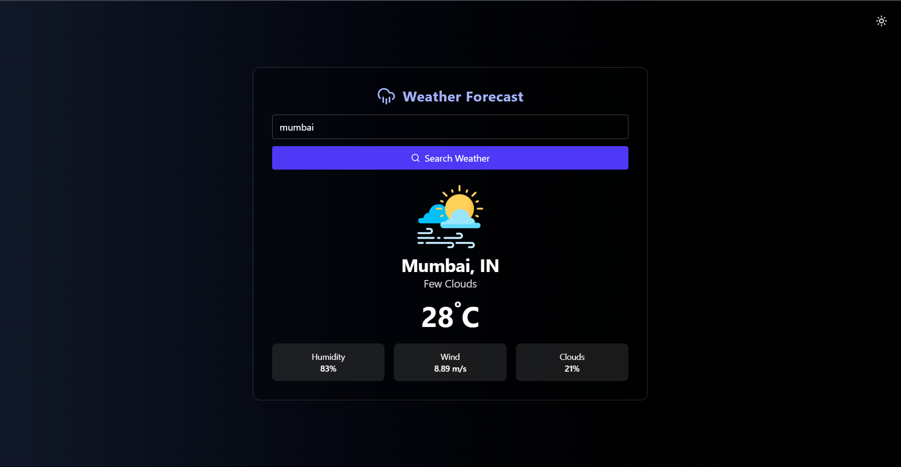
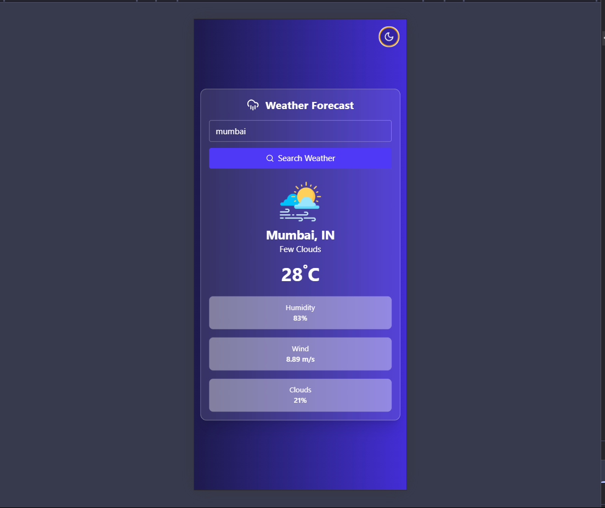
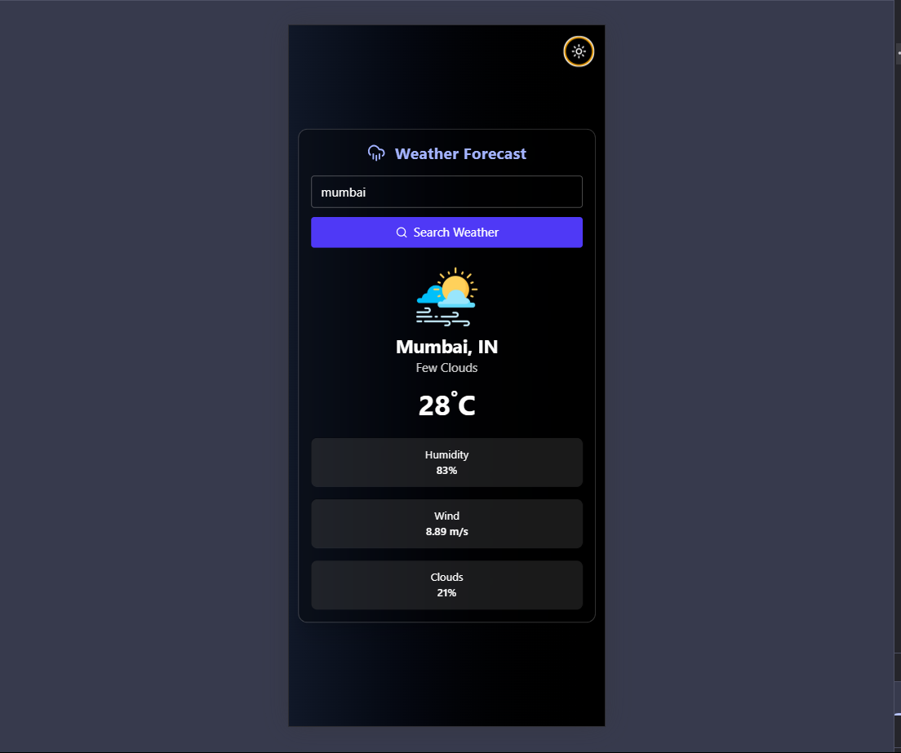
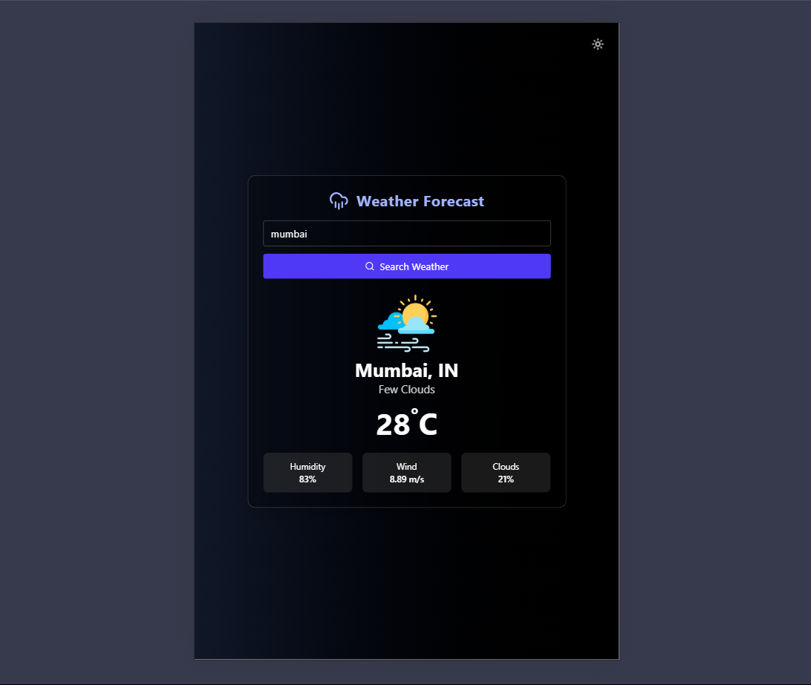
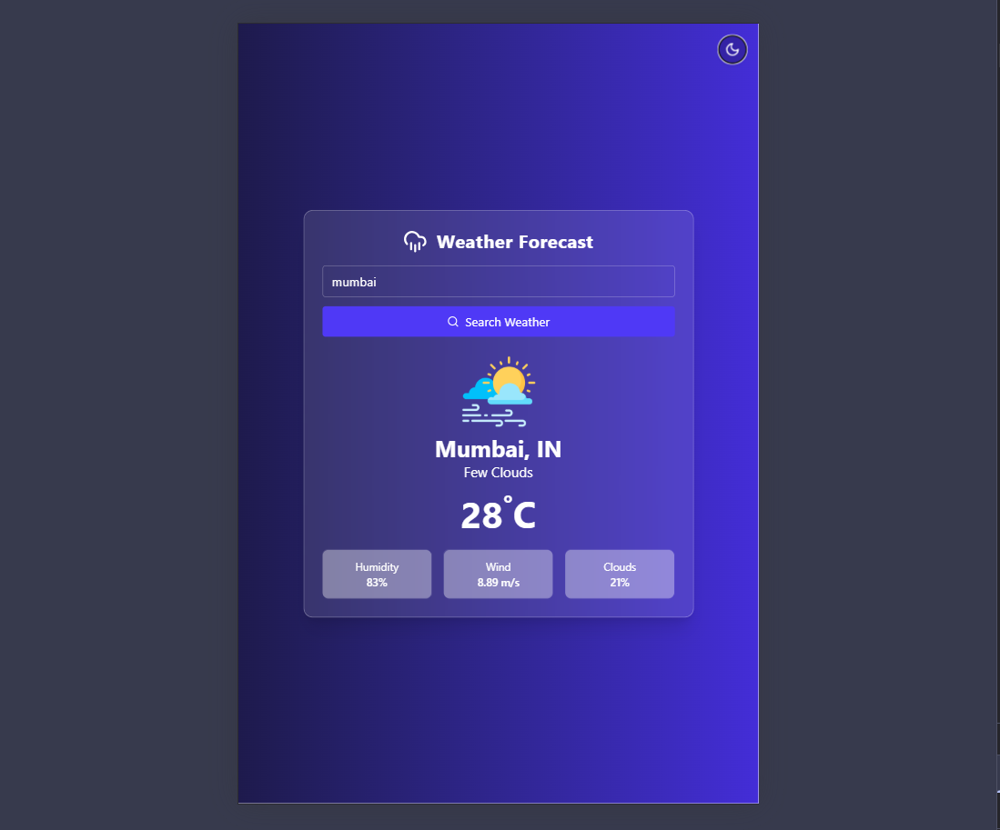

# 🌦️ Weather Forecast App

A responsive weather forecast web application built using **React**, **Vite**, and **Tailwind CSS**. This app fetches real-time weather data from the **OpenWeatherMap API** and supports **city search**, **geolocation-based weather**, and **light/dark mode** UI.

---

## 📌 Features

- 🌐 Search weather by **city name**
- 📍 Fetch weather using **your current location**
- 🌗 **Light/Dark mode** toggle
- 📱 Fully **responsive design** (mobile, tablet, desktop)
- 📦 Built with **React + Vite**
- 🎨 Styled using **Tailwind CSS**
- 🔐 Secure API Key via `.env` file

---

## 🧱 Tech Stack

| Tech           | Description                 |
| -------------- | --------------------------- |
| React          | JavaScript UI library       |
| Vite           | Fast frontend build tool    |
| Tailwind CSS   | Utility-first CSS framework |
| OpenWeatherMap | Weather data API            |
| Lucide-react   | Icon library                |

---

## 🖼️ Screenshots

> 📱 Mobile | Tab | 💻 Desktop | 🌗 Dark Mode

### 🌐☀️ Desktop light View


---

### 🌙 Desktop Dark View



### 📱☀️ Mobile light View



---

### 📱🌙 Mobile Dark View



### Tablet Dark Mode



---

### Tablet Light Mode



---

## 🚀 Getting Started

### 1. Clone the repo

```bash
git clone https://github.com/sumitkumarsharm/WeatherApp
```

### 2. Install dependencies

```bash
cd react-weather-app
npm install
```

### 3. Start the app

```bash
npm run dev
```
